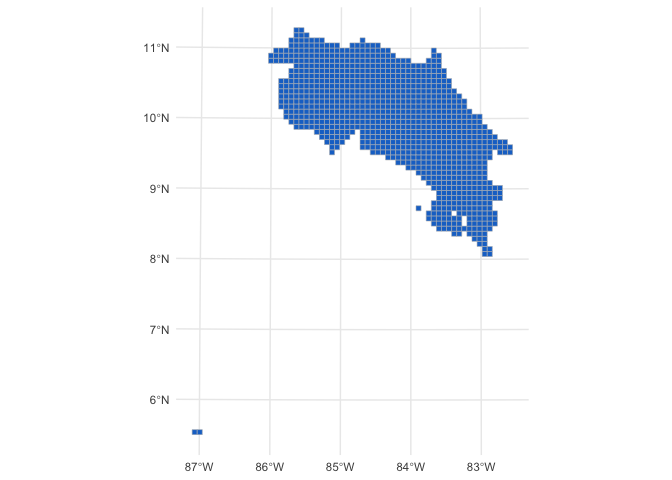

crgrids: hierarchical geospatial grids for Costa Rica
================

<!-- README.md is generated from README.Rmd. Please edit that file -->

# crgrids 

<!-- badges: start -->
<!-- badges: end -->

The goal of crgrids is to provides spatial grids for Costa Rica.

Square spatial grids of 1km, 2km, 4km, and 8km.

## Installation

You can install the development version of crgrids from
[GitHub](https://github.com/) with:

``` r
# install.packages("devtools")
devtools::install_github("ManuelSpinola/crgrids")
```

## Example

This is a basic example which shows you how to use crgrids:

``` r
library(tidyverse)
#> ── Attaching core tidyverse packages ──────────────────────── tidyverse 2.0.0 ──
#> ✔ dplyr     1.1.3     ✔ readr     2.1.4
#> ✔ forcats   1.0.0     ✔ stringr   1.5.0
#> ✔ ggplot2   3.4.4     ✔ tibble    3.2.1
#> ✔ lubridate 1.9.3     ✔ tidyr     1.3.0
#> ✔ purrr     1.0.2     
#> ── Conflicts ────────────────────────────────────────── tidyverse_conflicts() ──
#> ✖ dplyr::filter() masks stats::filter()
#> ✖ dplyr::lag()    masks stats::lag()
#> ℹ Use the conflicted package (<http://conflicted.r-lib.org/>) to force all conflicts to become errors
library(sf)
#> Linking to GEOS 3.11.0, GDAL 3.5.3, PROJ 9.1.0; sf_use_s2() is TRUE
library(crgrids)
```

``` r
ggplot(cr_grid_8km) +
  geom_sf(fill = "dodgerblue3", color = "gray") +
  theme_minimal()
```


